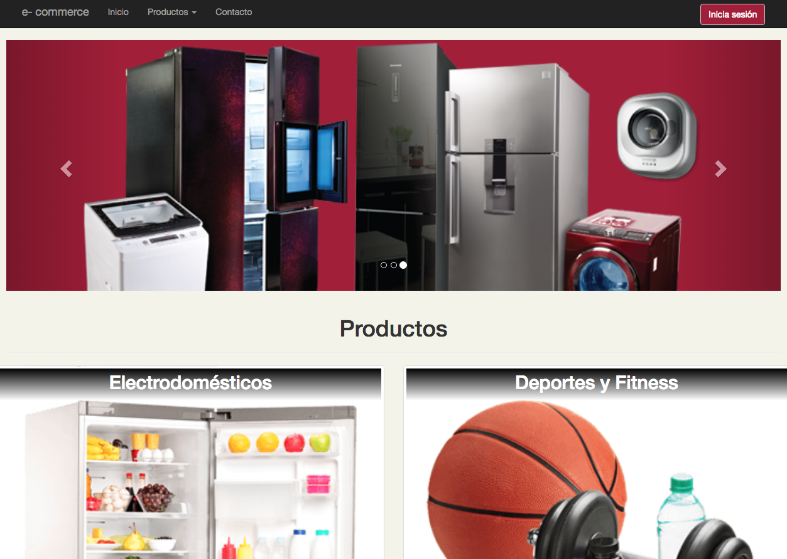
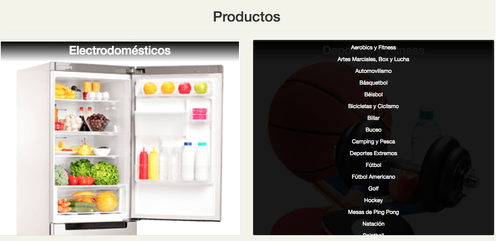
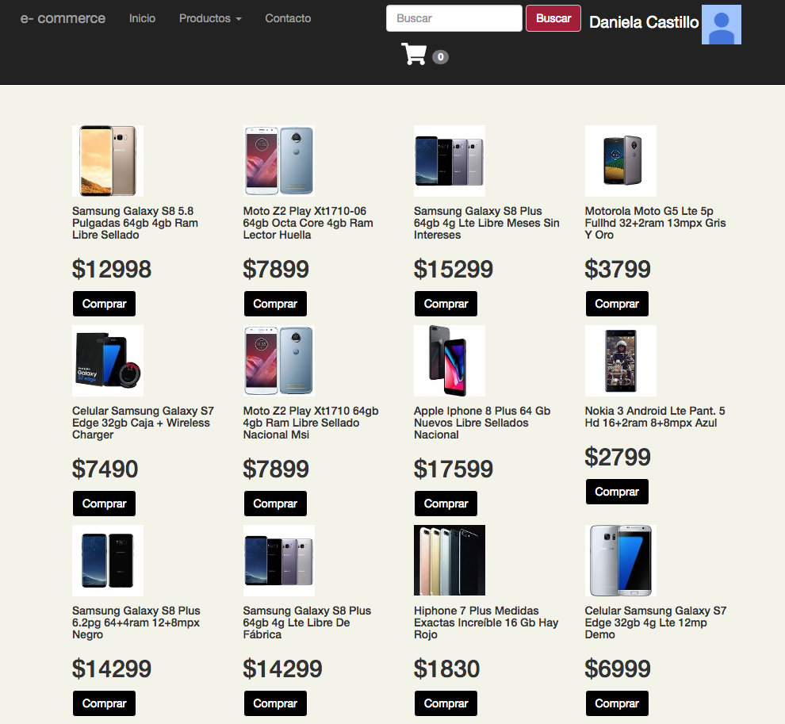
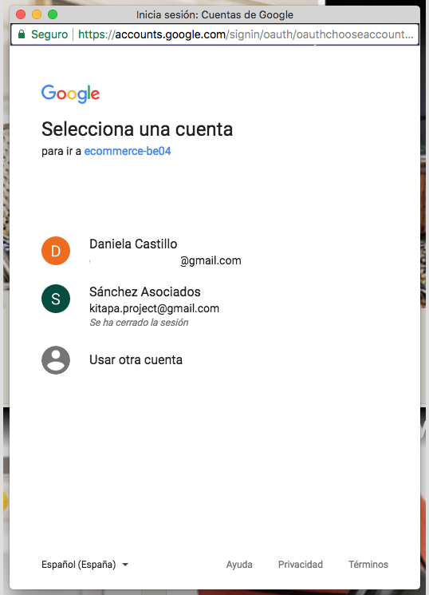
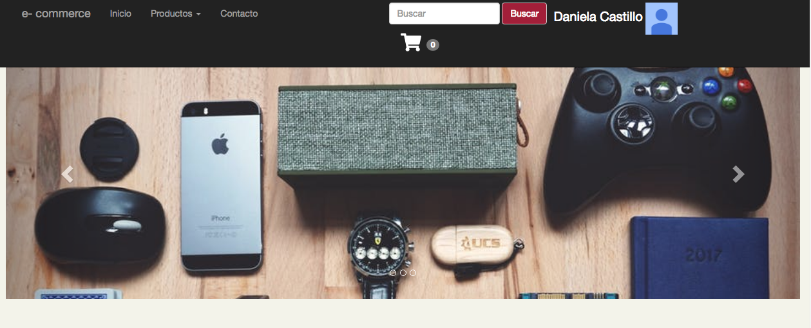
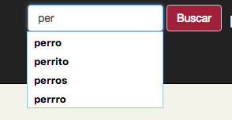
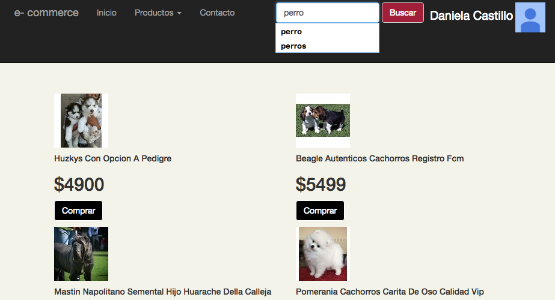
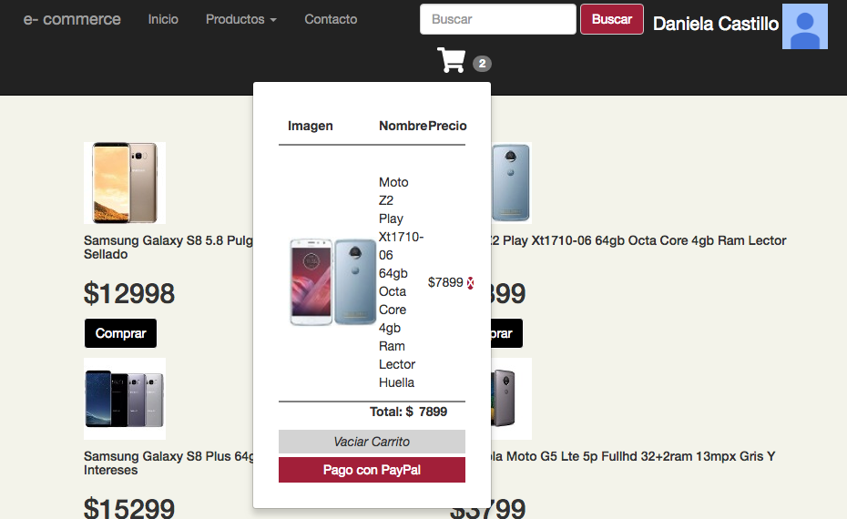

# e-commerce

**Single page application** creada para la compra de artículos, utiliza la API de Mercado Libre para obtener las categorías así como sus productos y la API de PayPal para efectuar los pagos.

Es necesario que el usurio inicie sesión con Google para que pueda efectuar cualquier compra.

Aparece el nombre de **_usuario_** y su **_imagen de perfil_** en la esquina superior derecha, indicando que se ha iniciado sesión correctamente.

Se pueden realizar búsquedas de acuerdo a lo que se desea adquirir.

Contiene un **carrito de compras** donde se puede visualizar los elementos agregados, brindando la opción de eliminarlos o vacíar el carrito.

